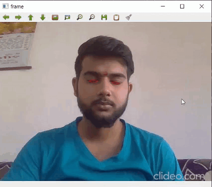

# Drowsiness-Detection

> ### You can download the shape_predictor_68_face_landmarks.dat by clicking [here](http://dlib.net/files/shape_predictor_68_face_landmarks.dat.bz2). Extract the content of zip file in the same folder where you have saved your source code.

